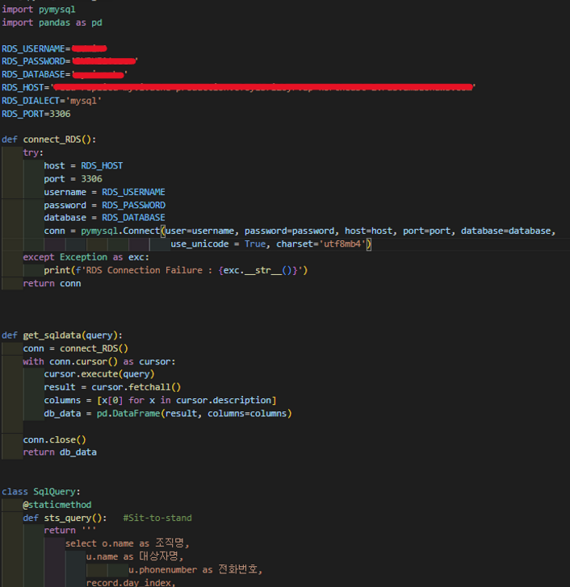
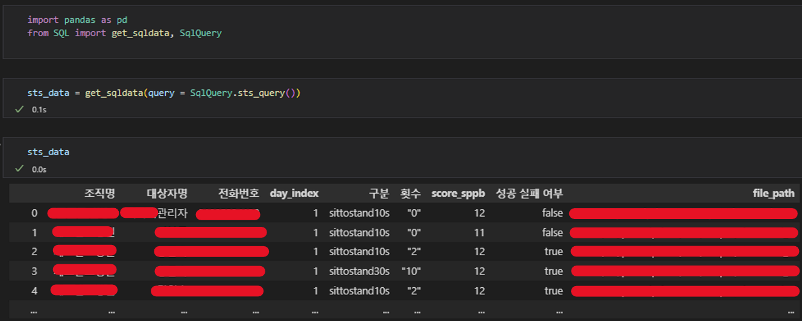

### 누구를 위해 FOR WHOM

SQL보다 Pandas가 더 익숙해서, SQL 데이터를 `pandas.DataFrame`으로 가져온 후 전처리를 하고 싶은 사람
Someone who is more familiar with Pandas than SQL and wants to import SQL data into `pandas.DataFrame` and do some preprocessing.

### 목적 PURPOSE

MySQL에서 Query문을 통해 조회된 데이터를 `pd.DataFrame`으로 쉽게 변환할 수 있는 Python 코드 제공
Provide Python code to easily convert data viewed through a query statement in MySQL to `pd.DataFrame`.

### 사용 USE

#### pymysql 설치 INSTALL pymysql
```
pip install pymysql
```

#### 디렉토리 DIRECTORY
`pd.DataFrame`을 작업할 Jupyter notebook이든, python 파일이든 `SQL.py`와 같은 폴더에 있어야 함.
The file to work with `pd.DataFrame` must be in the same folder as `SQL.py`.

#### SQL.py
당연히 MySQL ID, Password, Host URL 등등 변경해 줘야 함.   
제대로 변경했음에도 안 되면 IP 주소 문제일 수 있으니 DB 관리자에게 따질 것.   
쿼리문은 doctstring을 return하는 함수로 작성되어야 함.   

Of course, you need to change MySQL ID, Password, Host URL, etc.   
If it doesn't work after changing it properly, it might be an IP address problem, so ask your DB administrator.   
The query statement should be written as a function that returns a doctstring.


### 예시 EXAMPLE

#### SQL.py


#### Converting

